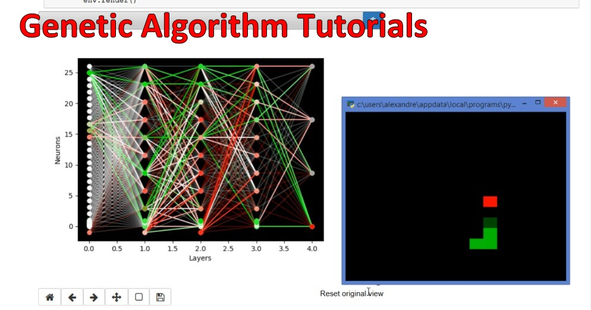

# Neural Networks Tutorial

A series of notebook to learn how Artificial Neural Networks work, with video support.

# 1. Neural Network principles notebook

The exercice notebook and its solution provide a first touch with the building blocks of low level neural networks.

The video is available [on youtube](https://www.youtube.com/watch?v=XJu-ZzE3sUo).

# 2. Your first genetic algorithm

The notebooks show the creation of a genetic algorithm from scratch to answer [Nicomon's Snek gym environment](https://github.com/nicomon24/Sneks).
The installation notebook proposes a few cells for Windows and Linux users.
The solution notebook presents the full code explained.

- [Gym environment and installation](https://www.youtube.com/watch?v=VEh8nwQtTwE&list=PL_mqLx7AmDzeG5kXYbhllIaLiZIALla3P&index=2)
  - [Gym exercice](https://www.youtube.com/watch?v=y8qF6guwvl4&list=PL_mqLx7AmDzeG5kXYbhllIaLiZIALla3P&index=3)
- [Principles of Evolutionary algorithm](https://www.youtube.com/watch?v=BCZt32L6Lx0&list=PL_mqLx7AmDzeG5kXYbhllIaLiZIALla3P&index=4)

# License

License is [GPL 3.0](LICENSE)
